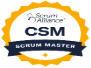
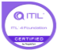

|
**SELVAKUMAR BALAKRISHNAN**

`          `Senior IT & Digital Transformation Leader, GenAI, Cloud & Enterprise Platforms

**📍Chennai, India**
|||||||||
| :-: | :- | :- | :- | :- | :- | :- | :- | :- |
||||||||||
||<b.selvakumar@yahoo.com>||📞+91 9566060099||||||
||||||||||

#
![ref1]![ref1]

|

![ref1]![ref1]![ref1]**LEADERSHIP & STRATEGIC CAPABILITIES**

|
**   

**PROFILE SUMMARY**

Senior AI, Cloud, and Digital Transformation Leader with 20+ years of experience delivering global, multi-million-dollar technology and platform programs across Healthcare, BFSI, Insurance, Manufacturing, and Enterprise SaaS ecosystems. 

Proven track record leading large-scale digital modernization, enterprise platform engineering, and AI-driven transformation initiatives across complex, regulated environments and global delivery models.

Expert in building and scaling **AI-first enterprise platforms**, including GenAI, Agentic AI, RAG-based knowledge systems, and AI-driven automation solutions. Deep experience in designing production-grade AI architectures covering LLMOps, context engineering, enterprise knowledge intelligence, and multi-agent orchestration. Proven record of delivering measurable business outcomes including **50% operational workload reduction, 40% MTTR improvement, improved service experience, and multi-million-dollar cost optimization** through AI, cloud, and data modernization.

PMP-certified technology executive experienced in aligning AI strategy with product engineering, GTM strategy, and enterprise transformation roadmaps. Known for building and scaling global engineering organizations (100+ teams), leading cross-functional AI, data, and platform teams, and driving enterprise AI adoption programs. Strong track record delivering large-scale compliant enterprise platforms across regulated industries including healthcare interoperability, financial systems, and mission-critical enterprise platforms.

.

`  `**EXECUTIVE IMPACT**

- Led GenAI + Agentic AI enterprise automation delivering 50% L1 reduction and 40% MTTR improvement

- Directed $10M+ global AI, Cloud, and Data portfolios across multi-geo teams

- Delivered $3.2M+ cost optimization through cloud and platform modernization

- Built and scaled 100+ global engineering teams across India, UK, and US

- Delivered mission-critical healthcare and payer platforms with HL7 /FHIR integrations

- Partnered with Product, Sales, and GTM teams on AI-driven solution positioning

|
| :- | - |
|
- AI, Digital & Cloud Transformation

- ` `Enterprise Platform & Data Modernization

- ` `AI Product Engineering & GTM Alignment

- ` `Large-Scale Program & Portfolio Leadership

- ` `Global Delivery & Partner Ecosystem Management

- ` `Financial Governance & Cost Optimization

- ` `ITSM & Operational Transformation

- ` `Executive Stakeholder & C-Suite Engagement
||
|
`       `**TECHNICAL & PLATFORM EXPERTISE**

||
|
- **AI & GenAI Platforms**: OpenAI, Anthropic Claude, AWS Bedrock, Agentic AI, RAG, GraphRAG, Neo4j Knowledge Graphs, Context Engineering, LLMOps

- **Cloud & Infrastructure:** AWS, Azure, GCP, Kubernetes, Docker, Helm, Ansible, CI/CD, Jenkins, CodeDeploy, JFrog

- **Data & AI-Ready Platforms:** Snowflake, Databricks, Vector Databases, MDM, Data Migration, Modern Data Architectures

- **Engineering & Platforms:** Python, .NET, C#, Golang, Java, Node.js, React, Vue, ETL / ELT, Mendix

- **Collaboration & Delivery:** Jira, Azure DevOps, Confluence

**CERTIFICATIONS**

- Project Management Professional (PMP)  License #3022220 

- Certified Scrum Professional (CSM)  Certification# 000469123

- Microsoft Azure Architect Technologies Certification # 000469123

- ITIL Foundation V 4 Certification  # 000469123

- Snowflake Discover AI

- GenaI Engineering
||

**AI LEADERSHIP & TRANSFORMATION EXPERTISE**

`             `**GenAI & Agentic AI Enterprise Platforms**

- Led design and delivery of **enterprise-scale multi-agent AI platforms** spanning ITSM, observability, identity management, and enterprise SaaS ecosystems, enabling intelligent automation across service operations, monitoring, and business workflows
- Architected **RAG-driven knowledge intelligence platforms** combined with advanced context engineering, improving response grounding and reducing LLM hallucination/error rates by **35%** across production enterprise AI workloads
- Delivered automation across **40+ enterprise workflows**, significantly improving operational efficiency, reducing manual intervention, and enabling scalable AI-assisted support models across global service environments
- Established production-grade **LLMOps and AI governance frameworks**, including model orchestration, evaluation pipelines, guardrails, prompt lifecycle management, and enterprise agent governance standards

**AI-Ready Cloud & Data Platform Architecture**

- Designed and implemented AI-ready, cloud-native platform architectures across AWS, Azure, and GCP to support scalable GenAI workloads, real-time inference pipelines, and enterprise AI data processing requirements
- Implemented containerized AI deployment frameworks using Kubernetes, Docker, Helm, and automated CI/CD pipelines, enabling rapid model deployment, versioning, and operational reliability at enterprise scale
- Modernized enterprise data ecosystems leveraging Snowflake, Databricks, vector databases, and hybrid batch/real-time data pipelines, enabling AI-ready data foundations and advanced analytics capabilities
- Led enterprise cloud transformation programs delivering measurable improvements in platform performance, operational resilience, and multi-million-dollar cost optimization through modernization and consolidation initiatives

**Enterprise AI Strategy & Executive Leadership**

- Define and execute enterprise AI strategy aligned with product roadmaps, go-to-market initiatives, and broader digital transformation programs, ensuring AI investments drive measurable business outcomes
- Advise executive leadership and C-suite stakeholders on **AI governance, responsible AI adoption, risk management, regulatory compliance, and enterprise ROI measurement frameworks**
- Lead global AI engineering, data, and platform organizations across multi-geo delivery models, driving cross-functional collaboration across business, product, and technology teams
- Drive enterprise-wide AI adoption through workforce enablement programs, AI operating model transformation, and organizational readiness initiatives supporting long-term AI maturity

**PROFESSIONAL EXPERIENCE**

**Movate Inc — Manager, Program Delivery, Jan 2025 – Present**

- Lead enterprise GenAI, cloud, and platform modernization programs driving AI adoption and digital transformation across client environments
- Own program roadmap, delivery governance, risk management, and executive stakeholder alignment across multi-geo teams
- Direct cross-functional AI, data, platform engineering, and operations teams to deliver scalable enterprise solutions

**Fortune Capital Services — GM, IT Product Delivery, Aug 2023 – Jan 2025**

- Directed enterprise platform engineering and digital product delivery initiatives supporting core business and customer platforms
- Partnered with business leadership and GTM teams to define and execute product roadmaps aligned with market and revenue objectives
- Scaled engineering delivery capability and strengthened agile governance, improving execution predictability and delivery quality

**Kanini Software Solutions — Senior Manager IT**

- Directed large-scale application modernization and enterprise cloud migration initiatives across multiple business portfolios
- Led engineering teams delivering multi-portfolio transformation programs, reusable accelerators, and modernization frameworks
- Drove solution conceptualization, product modernization strategy, and end-to-end architecture design

**DXC Technologies — Senior Project Manager**

- Delivered large-scale IT modernization and hybrid cloud transformation programs for global enterprise customers
- Managed production support and platform stability for multiple enterprise client environments with SLA-driven execution
- Led client engagement, transition planning, and delivery governance for complex transformation programs

**SGT India — Technology Leader, Product Delivery**

- Led enterprise product engineering initiatives and large-scale platform delivery programs
- Managed cross-functional engineering teams of 30+ members across development, QA, and delivery functions
- Defined solution architecture and ensured compliance with enterprise, security, and regulatory standards
#
**DOMAIN EXPERIENCE**

- Healthcare (Payer & Provider): Delivered enterprise healthcare platforms including NHS UK EHR/EPR Care Management systems, and payer transformation programs with Change Healthcare and Thomson Reuters, covering RCM workflows, eligibility, claims processing, and HL7/FHIR interoperability integrations

- Insurance / Payer Ecosystems: Led cloud, data, and enterprise platform transformation programs for global insurers including Zurich (UK/US) and Aon UK, supporting policy administration, claims processing, and enterprise data modernization initiatives

- Banking & Financial Services: Delivered enterprise technology and platform initiatives for global financial institutions including CHASE, Lehman Brothers, and Deloitte, supporting core banking, enterprise systems, and regulatory-compliant platforms

- Public Sector & eLearning: Delivered digital platform solutions for US Department of Transport supporting enterprise learning and compliance technology ecosystems

- Logistics & Supply Chain: Supported enterprise platform and operational transformation programs for global logistics organizations including SIRVA US and Southern Roadways India

- Power & Energy: Delivered large-scale cloud and data modernization programs for National Grid UK supporting enterprise analytics and operational transformation

- Manufacturing & Supply Chain Technology: Delivered enterprise platform and digital transformation initiatives for manufacturing ecosystems including MSL India

[ref1]: Aspose.Words.f2986ea9-5c3c-4e3f-ab66-4d86af703b24.007.png
